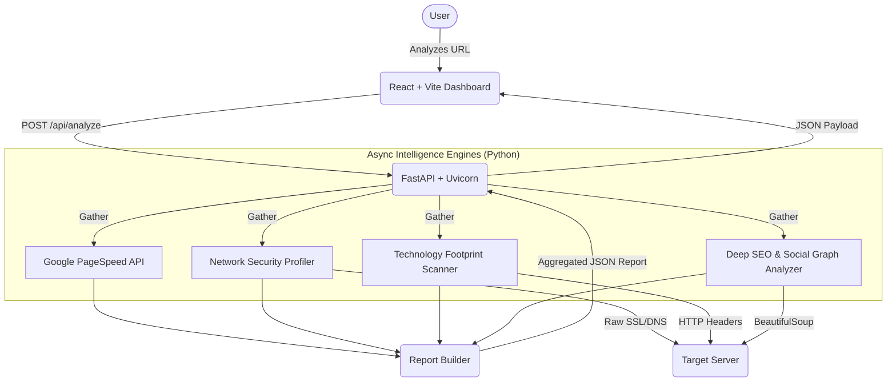

# SitePulse

## About
SitePulse is a full-stack Website Performance Audit Engine that analyzes real-world websites using Google PageSpeed Insights API and generates structured technical optimization recommendations.

<!-- Replace 'project_screenshot.png' with the actual path to your image later -->

## System Architecture

## Features

###  Core Web Vitals Engine
- Deep integration with Google PageSpeed Insights API.
- Live measurement of Performance, Accessibility, SEO, and Best Practices (PWA) scores.
- Dynamic Executive Summary intelligently generated based on the aggregated health of the target URL.

###  Network & Security Profiler
- **Deep SSL Analysis**: Extracts certificate issuer, validity status, protocol version, and exact days until expiry using raw Python sockets.
- **DNS Routing Inspector**: Bypasses the browser to interrogate the target server directly, extracting raw IPv4 `A` records, Mail `MX` records, and SPF `TXT` records.
- **Security Headers**: Scans network responses for critical security policies like HSTS, Content Security Policy (CSP), and X-XSS-Protection.

###  Technology Footprint Scanner
- Crawls and parses HTTP response headers and raw HTML to reverse-engineer the host's technology stack.
- Determines the Frontend Frameworks (React, Vue, etc.), Web Servers (Nginx, Express), Analytics Tools, Content Management Systems (CMS), and Content Delivery Networks (CDN).

### Deep SEO & Social Graph Analyzer
- Fully decoupled from Lighthouse, utilizing Python `BeautifulSoup4` to download and map the target URL's HTML structure.
- Previews exactly how the website will render when shared on platforms like Twitter, Facebook, and LinkedIn.
- Validates OpenGraph metadata (`og:title`, `og:image`, `og:description`), Twitter Card tags, Canonical links, and `<h1>` through `<h6>` geography.

###  Enterprise SaaS Dashboard
- Built with React and Vite.
- Persistent split-pane navigation layout utilizing `lucide-react` iconography.
- Buttery-smooth transitions and fully dynamic data-binding (zero hardcoded mockups).

## Tech Stack
- **Frontend**: React, Vite, standard CSS.
- **Backend**: Python, FastAPI, Uvicorn, HTTPX, BeautifulSoup4, DNSPython, Python-Whois.
